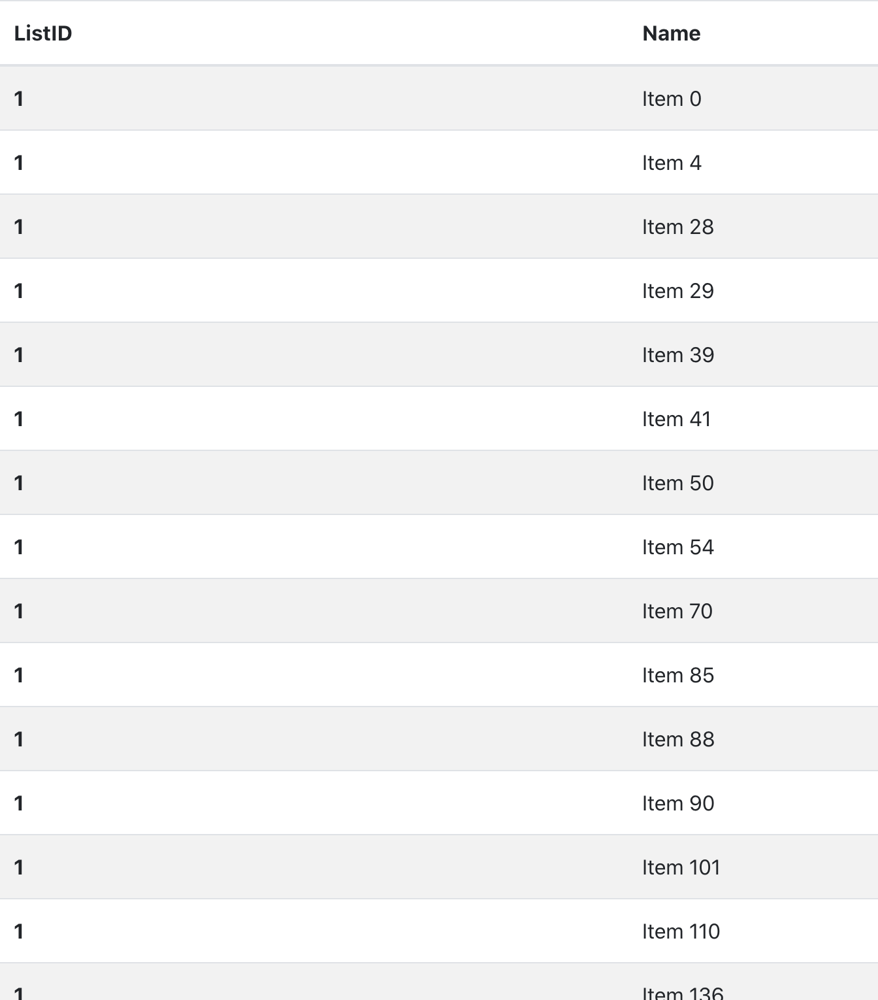

# frFrontEnd

This project was created with Create React App, Bootstrap and Axios.

Help to fix the blocked CORS error https://cors-anywhere.herokuapp.com

---

In the project directory, you can run:

### `npm install`

### `npm start`

Open [http://localhost:3000](http://localhost:3000) to view it in the browser.

The sorted list page will show up.

